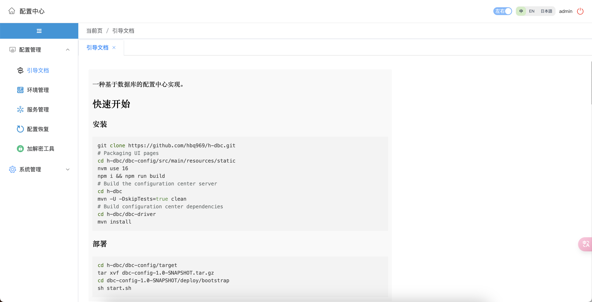
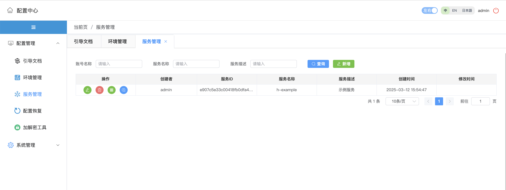

一个基于数据库(mysql、oracle)的配置中心实现。

A configuration center implementation based on database (mysql, oracle).


## 快速开始 (Quick Start)
### 安装
```bash
git clone https://github.com/hbq969/h-dbc.git
cd h-dbc/dbc-config/src/main/resources/static
nvm use 16 
npm i && npm run build
cd h-dbc 
mvn -U -DskipTests=true clean
cd h-dbc/dbc-driver
mvn install
```

### 部署
```bash
cd h-dbc/dbc-config/target
tar xvf dbc-config-1.0-SNAPSHOT.tar.gz
cd dbc-config-1.0-SNAPSHOT/deploy/bootstrap
sh start.sh
```


## 配置 (Config)
### 配置中心配置
> application-mysql.yml
```yaml
spring:
  datasource:
    type: com.zaxxer.hikari.HikariDataSource
    dynamic:
      enabled: true
      base-packages: com.github.hbq969
      default-lookup-key: hikari
    hikari:
      jdbc-url: 数据库url
      driver-class-name: com.mysql.cj.jdbc.Driver
      username: 账号
      password: 密码
      maximum-pool-size: 10
      minimum-idle: 2
      max-lifetime: 1800000
      connection-test-query: SELECT 1
  mvc:
    interceptors:
      login:
        enabled: true
        dialect: mysql

mybatis:
  mapper-locations:
    - classpath*:mappers/*.xml
    - classpath*:**/mapper/common/*Mapper.xml
    - classpath*:**/mapper/mysql/*Mapper.xml
  config-location: classpath:jpaConfig-mysql.xml
```

### 服务配置
> bootstrap.yml
```yaml
spring:
  cloud:
    config:
      h-dbc:
        # 以下配置和配置中心数据库配置保持一致
        enabled: true
        driver-class-name: com.mysql.cj.jdbc.Driver
        url: 数据库url
        username: 数据库账号
        password: 数据库密码
        dbc-key: h-dbc
        service-name: h-example
        profile-name: dev
```

> 服务依赖
```xml
<dependency>
    <groupId>com.github.hbq969</groupId>
    <artifactId>dbc-driver</artifactId>
    <version>1.0-SNAPSHOT</version>
</dependency>
```

## 功能演示 (Features)







## 问题联系 (Contact)

[hbq969@gmail.com](mailto:hbq969@gmail.com)
